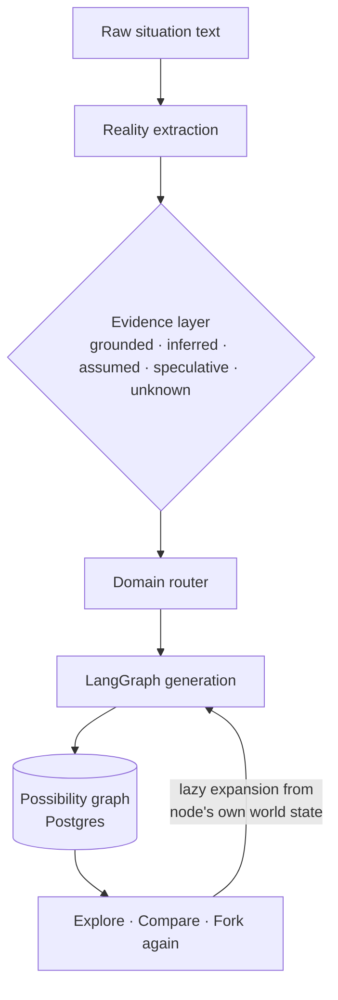
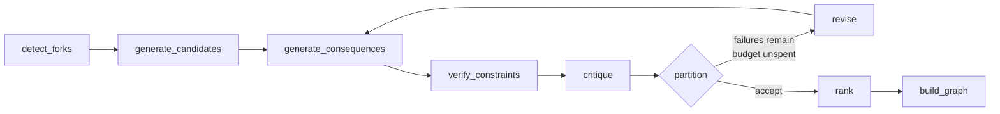

<div align="center">

# WHAT IF

**A counterfactual possibility explorer.**

Give it a real situation. It extracts what is actually known, generates alternative
trajectories, validates them against constraints and evidence, and lets you explore
the surviving possibility graph.

[](https://github.com/Ansarafsar/what-if/actions/workflows/ci.yml)
[](https://ansarafsar.github.io/what-if/)


[Live docs & architecture](https://ansarafsar.github.io/what-if/) ·
[Quick start](#quick-start) ·
[Architecture](#architecture) ·
[Failover](#reliability--failover)

</div>

---

> *"What if I could fork reality and explore the lives hidden behind the decisions
> I didn't make?"*

WHAT IF is **not** a chatbot, fortune teller, or decision maker. The LLM proposes
structured hypotheses; the application validates, scores, and visualizes them.
Every claim is classified as `GROUNDED`, `INFERRED`, `ASSUMED`, or `SPECULATIVE`.

<table>
<tr>
<td width="33%" valign="top">

### 🧭 Facts, not vibes
Every claim carries an evidence class. Missing information becomes `UNKNOWN` —
never invented.

</td>
<td width="33%" valign="top">

### ⚙️ LLM proposes, code disposes
Constraint checking, scoring, dedup and comparison are deterministic engines.
Same input → same graph.

</td>
<td width="33%" valign="top">

### 🌱 Forkable, not final
Every outcome stores the world it produced, so you fork again *from inside it* —
not from the original reality.

</td>
</tr>
</table>

## Quick start

```bash
cp .env.example .env
# For real reasoning set LLM_PROVIDER to openrouter, openai or anthropic,
# plus that provider's API key.
# Without them the stack runs on canned demo data and says so on every response.
docker compose up --build
```

| Service | URL |
|---|---|
| Frontend | http://localhost:3000 |
| API | http://localhost:8000/api/v1/health |
| Swagger docs | http://localhost:8000/docs |
| PostgreSQL (pgvector image) | localhost:5432 |

Database migrations run automatically when the API container starts.

<details>
<summary><b>Development without Docker</b></summary>

Backend:

```bash
cd apps/api
python -m venv .venv
.venv\Scripts\pip install -e ".[dev]"     # POSIX: .venv/bin/pip ...
.venv\Scripts\pytest
```

Frontend:

```bash
cd apps/web
npm install
npm run dev        # dev server
npm test           # vitest
npm run build      # production build + typecheck
```

</details>

<details>
<summary><b>Repository layout</b></summary>

```text
what-if/
├── apps/
│   ├── web/            Next.js 16 · TypeScript · Tailwind v4 · shadcn-style UI
│   └── api/            FastAPI · Pydantic v2 · SQLAlchemy 2 · Alembic
├── packages/shared/    reserved; API schemas currently live in apps/web/lib/schemas.ts
├── infra/
│   ├── docker/         Dockerfile.api · Dockerfile.web
│   └── postgres/init/  bootstrap extensions (pgvector)
├── evals/              21 scenario fixtures + scoring harness
├── docs/               architecture notes
├── site/               static docs site (HTML/CSS/JS) deployed to GitHub Pages
└── scripts/
```

</details>

## How it works



The product primitive is a graph you can walk: **fork reality, walk the branches,
fork again.** Every outcome node stores the world state it produced, so expanding
it reasons from *that* world — the children of "Accept the offer" are generated in
a world where the offer was accepted, not in the original reality.

## Architecture

### Orchestration: LangGraph with a bounded revise loop



The revise edge is the part a linear pipeline could not express: critic verdicts
and constraint violations feed back into a targeted regeneration of **only the
failing branches** — passing branches keep their consequences and reviews, so a
repair pass costs one LLM call per broken branch, not a full resample.
Constraint violations route to revision and are only rejected once the iteration
budget is spent; a hard constraint is never negotiable.

Forks detected but not expanded are persisted as unexpanded decision nodes, so
the alternatives the engine already found are one click away rather than thrown
away.

### Architecture invariants

| Invariant | What it means |
|---|---|
| **LLM proposes, code disposes** | Every stage returns schema-validated JSON (Pydantic), with bounded retries; malformed output never reaches the DB |
| **Evidence classes** | `grounded / inferred / assumed / speculative / unknown` on facts; branches carry assumptions with dependency keys |
| **Deterministic engines** | Constraint checking, value-aware dedup, weighted scoring, beam-width pruning, acyclic-graph validation. Same inputs → same graph |
| **Domain modules** | 9 domains, each declaring causal variables, dimensions, canonical forks, seed strategies, hard rules and determinism level |
| **Observability** | Every stage call recorded to `llm_executions` (model, prompt version, latency, tokens, retries, success) |

Scoring weights: `relevance .25 · plausibility .25 · impact .20 · novelty .15 ·
reversibility .05 − redundancy .10 − critic penalties`.

Domain modules cover career, relationship, business, software, purchase, finance,
habit, reflection and general — with hard rules like *relationship: never claim
another person's mental state* and determinism levels (`llm_led | hybrid | calc_led`).

### API

```text
POST /api/v1/scenarios                             create scenario from raw text
POST /api/v1/scenarios/{id}/extract                NL → validated RealityState
GET  /api/v1/scenarios/{id}/reality                latest extracted state
POST /api/v1/scenarios/{id}/generate               run the generation graph
POST /api/v1/scenarios/{id}/generate/stream        same, as SSE stage events
GET  /api/v1/scenarios/{id}/graph                  PossibilityGraph
GET  /api/v1/scenarios/{id}/nodes/{node_id}        node detail + children
POST /api/v1/scenarios/{id}/nodes/{node_id}/expand generate this node's children
POST /api/v1/scenarios/{id}/compare                deterministic 2-branch diff
```

### Expansion and comparison

`expand` is idempotent — a node that already has children returns them without an
LLM call — and is depth-guarded by `ENGINE_MAX_DEPTH` (default 4). `compare` runs
no LLM at all: it diffs two branches' effects and world states deterministically
and returns per-dimension direction and magnitude, explicitly labelled *relative,
not objective*.

## Reliability & failover

### Transient upstream failures

`429 / 502 / 503 / 504` and network errors back off exponentially
(2s, 4s, 8s… capped at 30s) with 25% jitter, so the per-branch consequence calls
do not retry in lockstep and rate-limit themselves again. A server-sent
`Retry-After` overrides our schedule up to a 120s ceiling — past that the request
fails rather than parking the caller.

> [!IMPORTANT]
> **OpenRouter fronts other providers**, so an upstream failure can arrive as
> **HTTP 200 with the real status nested in the body** (`{"error": {"code": 429}}`).
> Retry logic that only reads `response.status_code` misses these entirely and
> fails on the first attempt. That case is detected and retried through the same
> ladder rather than being misread as a malformed payload.

| Failure mode | Response |
|---|---|
| HTTP `429/502/503/504` | Exponential backoff + 25% jitter, capped 30s |
| HTTP 200 with nested error code | Same ladder — body is inspected, not just the status line |
| `Retry-After` header | Honoured, up to a 120s ceiling; beyond that, fail fast |
| Network error / timeout | Retried on the same ladder |
| Malformed JSON | Repaired by feeding the validation error back to the model — **no sleep**, a schema error is the model's fault, not the server's |
| Unknown provider configured | Refused with `503` rather than silently serving fixtures |
| Any error path | Persists its `llm_executions` row *before* raising, so a failure always leaves a trace |

Attempts are `LLM_MAX_RETRIES + 1` (default 3) and every retry is counted in
`llm_executions`.

### Mock mode is loud

With `LLM_PROVIDER=mock`, every scenario is answered from the canned Bengaluru
fixture. The API logs a startup warning and every affected response carries
`"mock": true`, which the UI renders as a banner — a deploy that forgets
to set a live `LLM_PROVIDER` cannot quietly serve demo data at HTTP 200.

## LLM providers

| Provider | Usage | Key |
|---|---|---|
| `mock` (default) | Deterministic Bengaluru demo responses; no key needed | — |
| `openrouter` | Any model on OpenRouter, incl. `:free` models | `OPENROUTER_API_KEY` |
| `openai` | OpenAI chat completions | `OPENAI_API_KEY` |
| `anthropic` | Anthropic Messages API | `ANTHROPIC_API_KEY` |

```bash
# OpenRouter
LLM_PROVIDER=openrouter
OPENROUTER_API_KEY=sk-or-...
LLM_MODEL=deepseek/deepseek-chat-v3-0324:free   # pick via scripts/list_openrouter_models.py

# OpenAI
LLM_PROVIDER=openai
OPENAI_API_KEY=sk-...
LLM_MODEL=gpt-4o
# OPENAI_ORGANIZATION / OPENAI_PROJECT are optional scoping headers

# Anthropic
LLM_PROVIDER=anthropic
ANTHROPIC_API_KEY=sk-ant-...
LLM_MODEL=claude-opus-5
```

All three live providers share one HTTP adapter
(`apps/api/app/llm/http_provider.py`), so the retry ladder, `Retry-After`
handling, jitter, in-body error detection and schema repair below apply
identically to each — only the wire format differs per provider. Adding a
provider is a subclass plus a registry entry, not a new copy of the failover
logic.

Per-provider handling worth knowing: OpenAI is asked for
`response_format: json_object` and has `temperature` omitted for reasoning
models (o-series, `gpt-5`) that reject it; Anthropic sends the system prompt
top-level, requires `max_tokens` (`ANTHROPIC_MAX_TOKENS`, default 8192), pins
`anthropic-version`, and concatenates text blocks so a `thinking` block never
masks the answer.

Prompt templates are versioned files in `apps/api/app/llm/prompts/`
(`reality_extraction.v1`, `fork_detection.v1`, `candidate_generation.v1`,
`candidate_revision.v1`, `consequence_generation.v1`, `critic_review.v1`) and
every execution logs the template version used.

## Evaluation

`evals/` holds 21 fixtures (at least one per domain) and a harness scoring
extraction completeness, grounding, hallucination resistance, schema validity,
branch coverage, branch diversity, constraint violations, domain routing, and
stability under rewording.

```bash
LLM_PROVIDER=openrouter python evals/harness/run.py      # measures the engine
python evals/harness/run.py --provider mock              # smoke-tests the harness
```

This is the only place reasoning quality is measured — tests running against
`MockProvider` can prove the plumbing works but only ever re-read their own
fixture. See [`evals/README.md`](evals/README.md).

## Exploration UI (`apps/web`)

- **dagre layout** at arbitrary depth (the old layout hardcoded three columns and
  clamped everything past depth 2 into the same one).
- **Fork again from here** on every unexpanded outcome node; expansion merges into
  the graph in place, with independent per-node loading state.
- **Detail side sheet** for *every* node type — outcome, fork, and reality —
  surfacing the score breakdown, the before → after state delta, constraint
  violations, assumptions, critic verdict, and the path taken to reach the branch.
- **Compare mode**: shift-click a second branch for the relative dimension table.
- **Honest progress**: the generation indicator is driven by SSE stage events from
  LangGraph, including revise iterations — not a timer cycling canned copy.
- **Runtime-validated API boundary**: every response is parsed against a Zod
  schema in `apps/web/lib/schemas.ts`, so a backend shape change fails loudly at
  the fetch, naming the field, instead of surfacing as `undefined` mid-render.

State is split by ownership: TanStack Query for server state, Zustand for
graph/selection/expansion — which is what lets the UI represent "viewing the graph
**and** expanding node 7", a state the old linear phase union could not express.

## Roadmap

| Phase | Deliverable | Status |
|---|---|---|
| 0 | Repository + infrastructure | ✅ |
| 1 | Reality engine + possibility pipeline | ✅ |
| 2 | LangGraph orchestration + bounded revise loop | ✅ |
| 3 | Lazy expansion API, node detail, deterministic compare | ✅ |
| 4 | Exploration UI: dagre graph, expand-on-click, compare, SSE progress | ✅ |
| 5 | Eval fixtures + scoring harness | ✅ |
| 6+ | More domains, richer causal modelling, larger fixture corpus | planned |

<details>
<summary><b>Deferred by design</b></summary>

- **Redis** — no consumer exists yet. Expansion is persisted in Postgres and
  idempotent, so nothing currently needs a cache. Reserved slot in compose/env.
- **`packages/shared`** — schemas live in `apps/web/lib/schemas.ts` until a second
  consumer exists; this repo is not an npm workspace, so a package there cannot
  resolve `zod`.

</details>

See [`docs/architecture.md`](docs/architecture.md) for the engineering thesis and
invariants, or the [documentation site](https://ansarafsar.github.io/what-if/) for
the illustrated version.

## Security notes

- `.env` is never committed; API keys stay server-side only.
- All LLM calls happen in the backend behind a provider interface.
- User scenarios are never logged in full by default.
